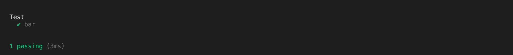
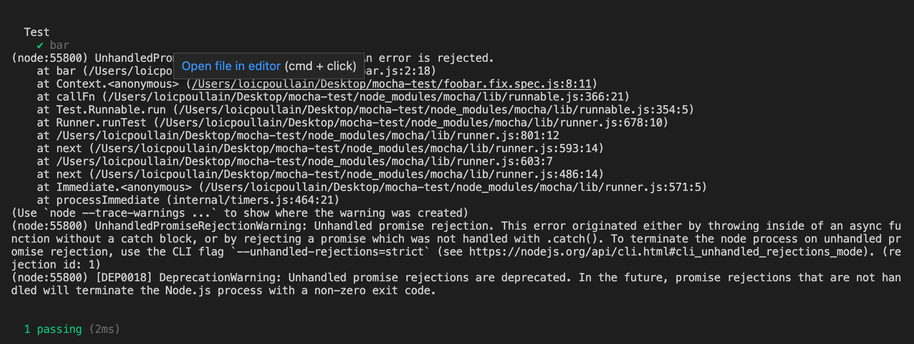
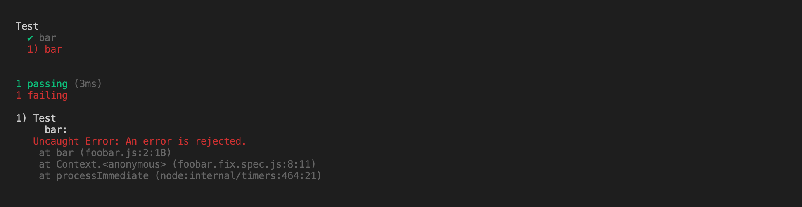

## Installation

```
npm install
```

## Test

Execute `npm run test`. The test passes as expected but the rejected promise is silently hidden.



We expect to have the output like when running `npm run start`:

*Node 14 and below*
```
(node:55254) UnhandledPromiseRejectionWarning: Error: An error is rejected.
    at bar (/Users/loicpoullain/Desktop/mocha-test/foobar.js:2:18)
    at Object.<anonymous> (/Users/loicpoullain/Desktop/mocha-test/main.js:3:1)
    at Module._compile (internal/modules/cjs/loader.js:1072:14)
    at Object.Module._extensions..js (internal/modules/cjs/loader.js:1101:10)
    at Module.load (internal/modules/cjs/loader.js:937:32)
    at Function.Module._load (internal/modules/cjs/loader.js:778:12)
    at Function.executeUserEntryPoint [as runMain] (internal/modules/run_main.js:76:12)
    at internal/main/run_main_module.js:17:47
(Use `node --trace-warnings ...` to show where the warning was created)
(node:55254) UnhandledPromiseRejectionWarning: Unhandled promise rejection. This error originated either by throwing inside of an async function without a catch block, or by rejecting a promise which was not handled with .catch(). To terminate the node process on unhandled promise rejection, use the CLI flag `--unhandled-rejections=strict` (see https://nodejs.org/api/cli.html#cli_unhandled_rejections_mode). (rejection id: 1)
(node:55254) [DEP0018] DeprecationWarning: Unhandled promise rejections are deprecated. In the future, promise rejections that are not handled will terminate the Node.js process with a non-zero exit code.
```

*Node 16 and above*
```
/Users/loicpoullain/Desktop/mocha-test/foobar.js:2
  Promise.reject(new Error('An error is rejected.'))
                 ^

Error: An error is rejected.
    at bar (/Users/loicpoullain/Desktop/mocha-test/foobar.js:2:18)
    at Object.<anonymous> (/Users/loicpoullain/Desktop/mocha-test/main.js:3:1)
    at Module._compile (node:internal/modules/cjs/loader:1101:14)
    at Object.Module._extensions..js (node:internal/modules/cjs/loader:1153:10)
    at Module.load (node:internal/modules/cjs/loader:981:32)
    at Function.Module._load (node:internal/modules/cjs/loader:822:12)
    at Function.executeUserEntryPoint [as runMain] (node:internal/modules/run_main:81:12)
    at node:internal/main/run_main_module:17:47
```

## Fixes

See file `foobar.fix.spec.js`.

*Node 14*


*Node 16*


## Suspected file where the problems comes from

https://github.com/mochajs/mocha/blob/master/lib/runner.js#L204

PR: https://github.com/mochajs/mocha/pull/4489

Behavior introduced in [v8.2.1](https://github.com/mochajs/mocha/releases/tag/v8.2.1).

Behavior is as expected in v8.2.0.